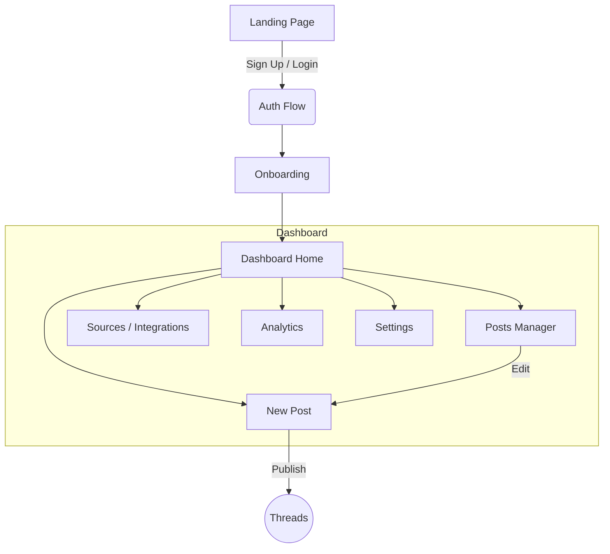

# Aeden - User Flow & Navigation Map

This document outlines the user journey, navigation structure, and key interactions for the Aeden platform.

## 🗺️ High-Level Site Map

---

## 1. Visitor Experience (Unauthenticated)

### Landing Page (`/`)
*   **Goal**: Convert visitors to users.
*   **Key Sections**:
    *   **Hero**: "Stop overthinking posts." + [Start Free] CTA.
    *   **Demo**: Visual of Manual Input -> AI Post generation.
    *   **Features**: Manual Input, GitHub Integration, Threads Publishing.
    *   **Pricing**: Free / Starter / Pro / Business cards.
    *   **Footer**: Links to Privacy, Terms, contact.

### Auth Flow (`/login`, `/signup`)
*   **Login**: Email/Password or OAuth (Google/GitHub/Supabase).
*   **Signup**: Same options.
*   **Redirect**: Post-auth redirects to `/onboarding/welcome` (if new) or `/dashboard` (if returning).

---

## 2. Onboarding Flow (First Time User)

> **Goal**: Get the user to value (first post) in < 60 seconds.

### Step 1: Persona Selection (`/onboarding/welcome`)
*   **Question**: "What type of work do you do?"
*   **Selection**: [Developer] [Designer] [Founder] [Creator] [Other]
*   **Action**: Saves to `user_preferences`. Sets initial Tone defaults.

### Step 2: Connections (Optional) (`/onboarding/connect`)
*   **Context**: "Connect a source to auto-generate posts, or skip."
*   **Options** (based on Persona):
    *   **Developer**: GitHub
    *   **Designer**: Information about Figma (Coming Soon)
    *   **Founder**: Information about Notion (Coming Soon)
*   **Action**: [Connect] (OAuth flow) OR [Skip for now]

### Step 3: First Post (`/onboarding/first-post`)
*   **Prompt**: "What did you work on this week?"
*   **Input**: Text area.
*   **Action**: [Generate First Post] -> Redirects to Dashboard with Draft ready.

---

## 3. Core Loop: The "Post" Flow

This is the primary user activity.

### 1. Initiation
*   **From Dashboard**: Click "New Post" button.
*   **From Source Sync**: Click "Generate from Commits" (GitHub).

### 2. Composition (`/dashboard/posts/new`)
*   **Input Mode**:
    *   **Manual**: User types rough notes ("Fixed login bug, added dark mode").
    *   **Source**: User selects a repo/commit or task.
*   **Controls**:
    *   **Tone Selector**: Casual / Professional / Technical (defaults from Persona).
    *   **Image**: Drag & drop upload (Supabase Storage).
*   **Action**: [Generate Draft]

### 3. Review & Refine
*   **AI Output**: Display generated content in a thread-like preview.
*   **Editing**:
    *   **Manual Edit**: User tweaks text directly.
    *   **Regenerate**: "Make it shorter", "Add emoji", "More professional".
*   **Status**: Auto-saved as `Draft`.

### 4. Publication
*   **Action**: [Publish to Threads]
*   **System**:
    1.  Checks Threads Token.
    2.  Posts via API.
    3.  Updates local status to `Published`.
    4.  Redirects to `/dashboard` with Success Toast.

---

## 4. Dashboard User Interface

### Global Layout
*   **Sidebar (Left)**:
    *   Logo (Home)
    *   **Main**: Home, Posts, Sources, Analytics.
    *   **Bottom**: Settings, User Profile.
    *   **Mobile**: Hamburger menu -> Drawer.
*   **Header**: Breadcrumbs, Notifications, Theme Toggle.

### Section Breakdown

#### A. Dashboard Home (`/dashboard`)
*   **Stats**: Posts this week, Total Engagement.
*   **Quick Actions**: [New Post] [Connect Source].
*   **Recent Activity**: List of last 3-5 posts with status indicators.
*   **Source Status**: "GitHub: Connected (Last sync 2m ago)".

#### B. Posts Manager (`/dashboard/posts`)
*   **Tabs**: All, Drafts, Scheduled, Published.
*   **List Item**: Post preview (text snippet), Date, Platform icon, Status Badge.
*   **Actions**: Edit, Delete, View on Threads.

#### C. Sources / Integrations (`/dashboard/sources`)
*   **Goal**: Manage incoming data.
*   **Cards**:
    *   **GitHub**: Connect/Disconnect, Select Repos.
    *   **Notion**: Connect/Disconnect, Select Databases.
    *   **Manual**: "Always active".

#### D. Settings (`/dashboard/settings`)
*   **Persona**: Update Role, Tone preferences (Voice Training in V2).
*   **Account**: Email, Password, Delete Account.
*   **Billing**: Manage Subscription (Stripe).

---

## 5. Key System States

| State | User Feedback | Action Required |
| :--- | :--- | :--- |
| **Empty Dashboard** | "No posts yet. Create your first?" | [Create Post] button prominent. |
| **Loading** | Skeletons for stats/lists. "Generating..." spinner for AI. | Wait. |
| **Error (Gen)** | "Couldn't generate. Try different input?" | Retry button. |
| **Error (Auth)** | "Session expired. Please login again." | Redirect to /login. |
| **Success** | "Post published!" toast. | None (auto-dismiss). |
